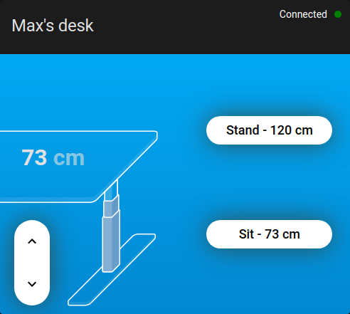
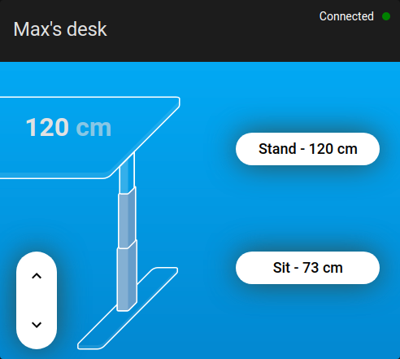

# Linak2MQTT

- Linak to MQTT dockerized service
- Use your bluetooth dongle without the need of an ESP32 device to control your desk
- Can be integrated with Home Assistant and https://github.com/IhorSyerkov/linak-desk-card

**Credits:** This project wouldn't have been possible without the incredible work done by [@rhyst](https://github.com/rhyst) on the [idasen-controller](https://github.com/rhyst/idasen-controller) project :heart:. Don't forget to give him a :star:!

# Table of content

- [Setup](#Setup)
  - [Prerequisites](#prerequisites)
  - [Bluetooth initial setup](#bluetooth-initial-setup)
  - [Run the docker image](#run-the-docker-image)
  - [MQTT interactions](#mqtt-interactions)
  - [Home Assistant integrations](#home-assistant-integrations)
    - [Lovelace linak-desk-card](#lovelace-linak-desk-card)
    - [Toggle the current position between sit and up using an NFC tag](#toggle-the-current-position-between-sit-and-up-using-an-nfc-tag)
    - [Automatically put the desk up for daily standup meetings](#automatically-put-the-desk-up-for-daily-standup-meetings)
- [Troubleshooting issues](#troubleshooting-issues)
- [Useful links](#useful-links)

# Setup

## Prerequisites

## Bluetooth initial setup

Your host must have your desk paired and trusted as a bluetooth device first.  
The reason for that being: When starting out the docker we give access to the bluetooth dongle and all the config. This way the docker image is able to connect to the desk straight away.

From the host:

- `bluetoothctl`
- `[bluetooth]# power off`
- `[bluetooth]# power on`
- Press the button on the desk for 2 or 3s till the LED is blinking
- `[bluetooth]# scan on`

Example of output while the scan is on

```
Discovery started
[CHG] Controller XX:XX:XX:XX:XX:XX Discovering: yes
[CHG] Device XX:XX:XX:XX:XX:XX RSSI: -83
[CHG] Device XX:XX:XX:XX:XX:XX RSSI: -71
[NEW] Device XX:XX:XX:XX:XX:XX Desk 7734 <-- notice the [NEW] here
[CHG] Device XX:XX:XX:XX:XX:XX RSSI: -75
[CHG] Device XX:XX:XX:XX:XX:XX RSSI: -95
```

- `[bluetooth]# scan off`
- `[bluetooth]# trust XX:XX:XX:XX:XX:XX`
- `[bluetooth]# pair XX:XX:XX:XX:XX:XX`

And from here you should see the prompt like this `[Desk 7734]#` meaning you're connected to the desk, at which point you must disconnect from it by typing `[Desk 7734]# disconnect`

All the configuration on the side of the host is now done and you should not have to manipulate anything here anymore.

## Run the docker image

The docker image will connect to your desk and interact with it through MQTT so that you can interact with it the way you want.

Before building and launching it:

- Copy `linak-2-mqtt.env.template` into a new file called `linak-2-mqtt.env` and update the values
- Copy `linak-config.yaml.template` into a new file called `linak-config.yaml` and update the values (at least the mac address)

Then:

- `docker build -t linak-2-mqtt .`
- `docker run -it --rm --privileged -v /var/run/dbus:/var/run/dbus -v $(pwd)/linak-2-mqtt.env:/.env -v $(pwd)/linak-config.yaml:/linak-config.yaml linak-2-mqtt`

## MQTT interactions

You can listen to:

- `linak-2-mqtt/desk-height-updated` which will pass the desk height as payload in cm

You publish to:

- `linak-2-mqtt/set-desk-height` pass the desk height you wish in cm
- `linak-2-mqtt/toggle-desk-position` no payload needed

## Home Assistant integrations

The MQTT API ensure you can build any kind of integration you'd like. Speaking for myself, I've chosen to use [Home Assistant](https://www.home-assistant.io). In this seection I'll explain how to specifically integrate your desk in Home Assistant and give some examples of automations.

### Lovelace linak-desk-card

[@IhorSyerkov](https://github.com/IhorSyerkov) has built a great (interactive) [Lovelace card](https://github.com/IhorSyerkov/linak-desk-card):

| Desk in sitting position                                                    | Desk in standing position                                                     |
| --------------------------------------------------------------------------- | ----------------------------------------------------------------------------- |
|  |  |

This was originally built to integrate with [ESPHome idasen-desk-controller](https://github.com/j5lien/esphome-idasen-desk-controller) _(see [linak-desk-card](https://github.com/IhorSyerkov/linak-desk-card)'s documentation)_, but I didn't want to have using another device hence why I built my own solution.

That's why we've got a little bit of configuration to make on Home Assistant in order to have the card working properly.

- Start by following [linak-desk-card's README](https://github.com/IhorSyerkov/linak-desk-card) and install the card using HACS
- Open your HA config file `/config/configuration.yaml` and either create or update your `sensor` and `binary_sensor` lists with the following:

```yaml
sensor:
  - platform: mqtt
    name: 'linak_desk_height'
    state_topic: 'linak-2-mqtt/desk-relative-height-updated'

binary_sensor:
  - platform: mqtt
    name: is_desk_available
    state_topic: 'linak-2-mqtt/desk-relative-height-updated'
    off_delay: 100
    value_template: "{{ 'online' }}"
    payload_on: 'online'
    payload_off: 'offline'
```

On your dashboard, we'll now create a new card:

```yaml
type: custom:linak-desk-card
min_height: 62
max_height: 127
presets:
  - label: Stand
    target: 120
  - label: Sit
    target: 73
name: Desk
height_sensor: sensor.linak_desk_height
connection_sensor: binary_sensor.is_desk_available
# @todo not implemented because I'm unsure what that'll change and it's not a priority for now
# moving_sensor: binary_sensor.is_desk_moving
desk: cover.desk
```

**Important note:**

Make sure the config above matches:

- The one defined in `linak-2-mqtt.env` that you're mounting on the docker container for:
  - `min_height` / `DESK_LOWEST_HEIGHT_CM`
  - `max_height` / `DESK_HIGHEST_HEIGHT_CM`
- The one defined in `linak-config.yaml` that you're mounting on the docker container:
- `presets[label="Stand"].target` / `stand_height`
- `presets[label="Sit"].target` / `sit_height`

This is slightly annoying to have some configuration duplicated but I haven't found a better option for now and it's not something you'll need to edit all the time.

Everything we did so far was in order to get the correct height displayed on the desk card. Now lets hook the 2 buttons stand and sit so we're able to control the desk from that card as well.

In order to do that, you'll need to create the following `automation`:

```yaml
alias: 'Desk: Bind cover.set_cover_position to MQTT'
description: ''
trigger:
  - platform: event
    event_type: call_service
    event_data:
      domain: cover
      service: set_cover_position
condition: []
action:
  - service: mqtt.publish
    data:
      topic: linak-2-mqtt/set-desk-height
      payload_template: >
         {{
        ((service_data.get('position') * (127 - 62) / 100) + 62) | round(0) }}
mode: single
```

Note: Same here, it'd be nice to get the `127` _(max height)_ and `62` _(min height)_ from the card config if possible but I haven't done it for now.

### Toggle the current position between sit and up using an NFC tag

```yaml
alias: 'Tag Desk: Toggle desk position'
description: ''
trigger:
  - platform: tag
    tag_id: YOUR-TAG-ID-HERE
condition: []
action:
  - service: mqtt.publish
    data:
      topic: linak-2-mqtt/toggle-desk-position
mode: single
```

### Automatically put the desk up for daily standup meetings

Last but not least, if you have some daily standup meeting for example, you could automatically put the desk up at that time if:

- It's a work day
- You're home
- A manual input boolean is currently on (in case you ever want to turn it off simply)

All this should let you avoid unnecessary triggers.

```yaml
alias: 'Desk: Standing position at standup time on workday if I am home'
description: ''
trigger:
  - platform: time
    at: '10:59:00'
condition:
  - condition: zone
    entity_id: device_tracker.PHONE_TRACKER_HERE
    zone: zone.home
  - condition: state
    entity_id: binary_sensor.workday_sensor
    state: 'on'
  - condition: state
    entity_id: input_boolean.shoulddeskgostandingpositiononworkdaysifiamhome
    state: 'on'
action:
  - service: mqtt.publish
    data:
      topic: linak-2-mqtt/set-desk-height
      payload: '120'
mode: single
```

Don't forget to create both:

- the `input_boolean` helper
- the `workday_sensor` if you don't have one already. _Example:_

```yaml
binary_sensor:
  # ... your other binary sensors
  - platform: workday
    name: workday_sensor
    country: FR
    workdays: [mon, tue, wed, thu, fri]
    excludes: [sat, sun]
```

Here's an example of complete dashboard:


```yaml
- theme: Backend-selected
  title: Office
  path: office
  badges: []
  cards:
    - type: custom:linak-desk-card
      min_height: 62
      max_height: 127
      presets:
        - label: Stand
          target: 120
        - label: Sit
          target: 73
      name: Desk
      height_sensor: sensor.linak_desk_height
      connection_sensor: binary_sensor.is_desk_available
      moving_sensor: binary_sensor.linak_desk_moving
      desk: cover.desk
    - type: entities
      entities:
        - entity: input_boolean.shoulddeskgostandingpositiononworkdaysifiamhome
          name: Automatically go up at standup time?
      title: Desk
      show_header_toggle: false
      state_color: false
    - type: entities
      entities:
        - entity: binary_sensor.workday_sensor
          name: Is today a work day?
          icon: mdi:office-building
      state_color: false
```

# Troubleshooting issues

If the logs show

```
[debug] Connected
starting idasen server...
Connecting
Connecting failed
Device with address XX:XX:XX:XX:XX:XX was not found.
```

Either:

- You've never connected the desk in bluetooth. Refer to `Bluetooth initial setup`
- Another device is already connected to the desk. Check first on your host machine if `bluetoothctl` shows `[bluetooth]#` or something like `[Desk 7734]#`. If it's `[bluetooth]` it means it's fine, the host is not connected to it (but you'll have to check your other devices like phone etc...), if it shows `[Desk 7734]#` the fix is easy, from here type `disconnect`: `[Desk 7734]# disconnect` and it should go back to `[bluetooth]#`. Stop and start again the docker image, everything should be fine
- Something has just gone wrong and none of the above fixes it. Try first on the host to
  - Turn the bluetooth on and off
    - `bluetoothctl`
    - `[bluetooth]# power off`
    - `[bluetooth]# power on`
  - Connect to the device again `[bluetooth]# connect XX:XX:XX:XX:XX:XX`
  - If that works, disconnect from it straight away (`[Desk 7734]# disconnect`) and relaunch the docker image
  - If that doesn't work, you may need to remove the device and make sure that you: Find it, trust it, pair it (in this order)
    - `[bluetooth]# remove XX:XX:XX:XX:XX:XX`
    - From here follow again the `Bluetooth initial setup` section

# Useful links

- https://github.com/rhyst/idasen-controller/issues/42#issuecomment-1059736659
